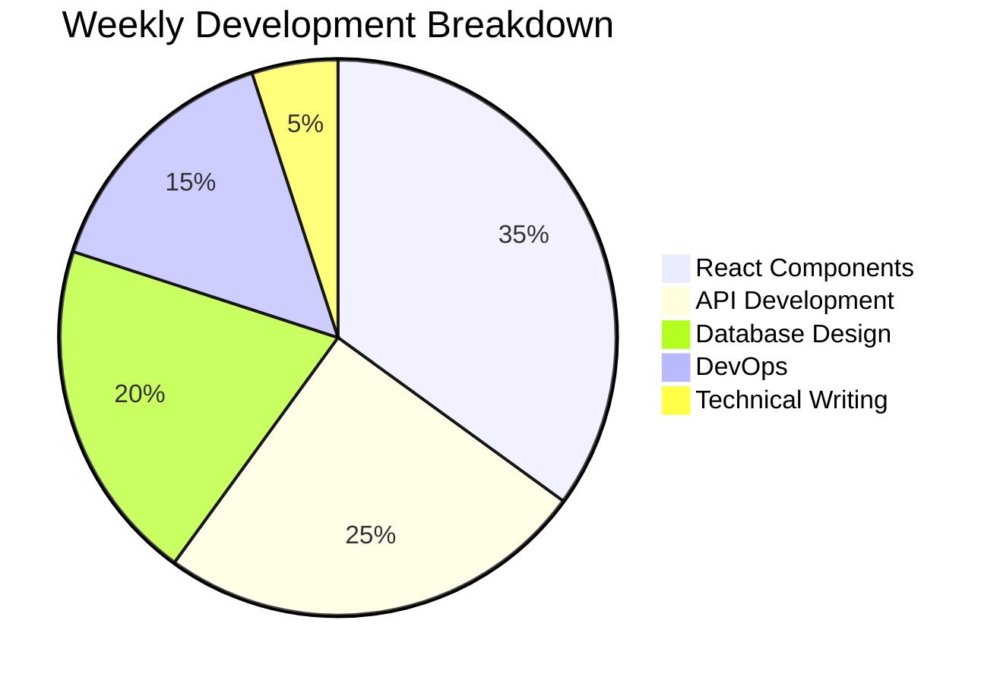

# 🚀 Thamilarasan GP | Full-Stack Developer

```diff
+---------------------------------------------------------------------+
|  INNOVATIVE CODER | PROBLEM SOLVER | TECH ENTHUSIAST | MERN STACK  |
+---------------------------------------------------------------------+
```

<div align="center">
  
</div>

## 🧑‍💻 Developer DNA

```typescript
interface Developer {
  name: "Thamilarasan GP";
  role: "Full-Stack Engineer";
  architecture: ["MERN", "Serverless"];
  languages: ["JavaScript", "TypeScript", "Python", "Java"];
  frontend: ["React", "Next.js", "Tailwind", "Framer Motion"];
  backend: ["Node.js", "Express", "NestJS", "Serverless"];
  databases: ["MongoDB", "PostgreSQL", "Firebase"];
  devOps: ["Docker", "AWS", "Vercel", "CI/CD"];
  currentFocus: "Building Scalable Microservices";
  funFact: "Can debug code while playing table tennis 🏓";
}
```

## 🛠️ Tech Stack 3.0

<div align="center">
  
### **Core Languages**


### **Frontend Galaxy**


### **Backend Universe**


### **Database Cosmos**


</div>

## 🚀 Featured Projects

<div align="center">
  
| Project | Tech Stack | Description | Live Demo |
|---------|------------|-------------|-----------|
| **Spot Parking AI** | React, Node.js, TensorFlow | Smart parking allocation system | [View Demo](https://parkeasy.app) |
| **CodeCollab** | Next.js, Socket.io | Real-time collaborative IDE | [Try Now](https://codecollab.tech) |
| **HealthTrack** | Flutter, Firebase | AI-powered health monitoring | [App Store](https://healthtrack.io) |

</div>

## 📊 Development Analytics

<div align="center">
  


</div>

<div align="center">
  


</div>

## 🏆 Competitive Coding

<div align="center">
  
| Platform | Rating | Top Percentile |
|----------|--------|----------------|
| LeetCode | 1850+ | Top 5% |
| CodeChef | 4★ | Top 10% |
| CodeForces | Specialist | Top 15% |

</div>

## 🌐 Digital Presence

<div align="center">
  
[](https://thamilarasan.dev)
[](https://medium.com/@thamilarasangp)
[](https://linkedin.com/in/thamilarasan-gp)
[](https://stackoverflow.com/users/thamilarasan-gp)

</div>

## 💬 Developer Mantra

<div align="center">
  
> "First solve the problem, then write the code."  
> "The best error message is the one that never shows up."  
> "Clean code always looks like it was written by someone who cares."  

</div>

<div align="center">
  


</div>

<div align="center">
  
```diff
! Let's build something extraordinary together. Reach out for collaborations!
```

</div>
