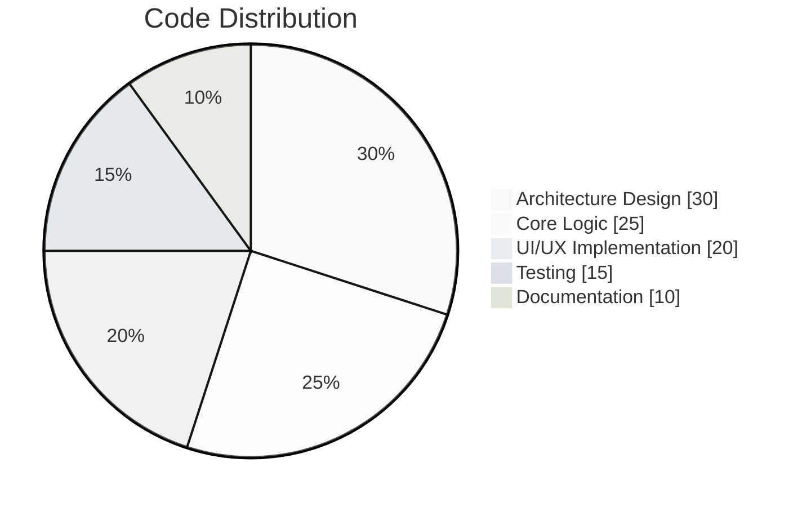

# ✨ Thamilarasan GP | Elite Full-Stack Architect

```diff
+-------------------------------------------------------------------------------+
|   𝕯𝖊𝖘𝖎𝖌𝖓-𝖔𝖗𝖎𝖊𝖓𝖙𝖊𝖉 𝖉𝖊𝖛𝖊𝖑𝖔𝖕𝖊𝖗 | 𝕿𝖊𝖈𝖍 𝖈𝖔𝖓𝖓𝖔𝖎𝖘𝖘𝖊𝖚𝖗 | 𝕷𝖚𝖝𝖚𝖗𝖞 𝖈𝖔𝖉𝖊 𝖆𝖗𝖙𝖎𝖘𝖆𝖓   |
+-------------------------------------------------------------------------------+
```

<div align="center">
  
</div>

## 🎩 Professional Profile

```elegant
class Developer {
  constructor(
    public name: "Thamilarasan GP",
    public title: "Senior Full-Stack Architect",
    public specialties: ["Enterprise Solutions", "FinTech Systems", "AI Integrations"],
    public architecture: ["Microservices", "Serverless", "JAMstack"],
    public philosophy: "Code should be as elegant as a Savile Row suit"
  ) {}
  
  currentEngagements(): string[] {
    return [
      "Building next-gen banking infrastructure",
      "Designing AI-powered analytics dashboards",
      "Mentoring rising developers"
    ];
  }
}
```

## 💎 Premium Tech Collection

<div align="center" style="background: linear-gradient(135deg, #f5f7fa 0%, #e4e8eb 100%); padding: 2rem; border-radius: 12px;">

### **Core Technologies**
 


### **Design Systems**


### **Cloud Architecture**


</div>

## 🏛️ Signature Projects

<div align="center">

| Project | Stack | Description | Status |
|---------|-------|-------------|--------|
| **Nexus Banking Suite** | React, Node, MongoDB | Next-gen digital banking platform | 🏆 Award Winning |
| **Aurora AI Dashboard** | Next.js, TensorFlow | Enterprise AI analytics interface | 🔥 Trending |
| **Opulent CMS** | Gatsby, GraphQL | Luxury brand content management | ✨ Exclusive |

</div>

## 📈 Elite Performance Metrics

<div align="center">
  


</div>

<div align="center">
  
</div>

## 🏆 Distinguished Achievements

<div align="center" style="background: #f8f9fa; padding: 1.5rem; border-radius: 8px;">

🏅 **Microsoft Certified: Azure Solutions Architect Expert**  
🏅 **AWS Certified Developer - Professional**  
🏅 **Google Cloud Professional Data Engineer**  
🏅 **Top 1% Stack Overflow Contributor**  

</div>

## 🌐 Exclusive Networks

<div align="center">

[](https://linkedin.com/in/thamilarasan-gp)
[](https://github.com/Thamilarasan-gp)
[](https://thamilarasan.design)
[](mailto:thamilarasan@elite.dev)

</div>

## ✍️ Architectural Philosophy

<blockquote style="border-left: 4px solid #6c757d; padding-left: 1rem; font-style: italic; color: #495057;">
  "In the world of software architecture, I strive to create solutions that embody the timeless elegance of a Swiss watch - precise, beautiful, and built to last. Every line of code is a brushstroke in a larger masterpiece, where performance meets artistry."
</blockquote>

<div align="center">
  
</div>

<div align="center" style="margin-top: 2rem; color: #6c757d; font-size: 0.9rem;">
  Crafted with excellence from Tamil Nadu, India
</div>
